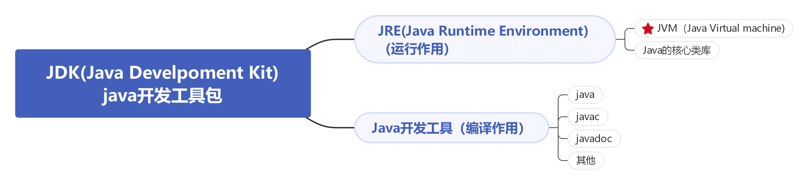
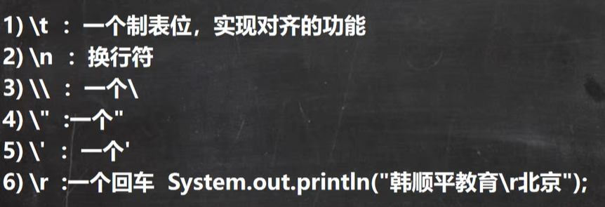
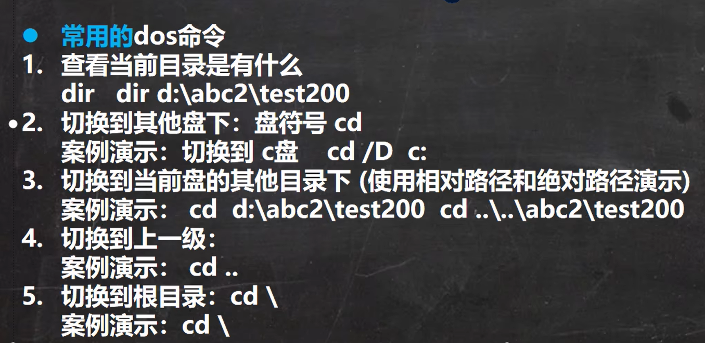
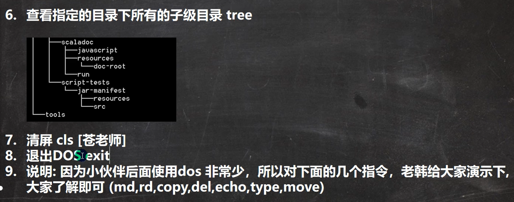
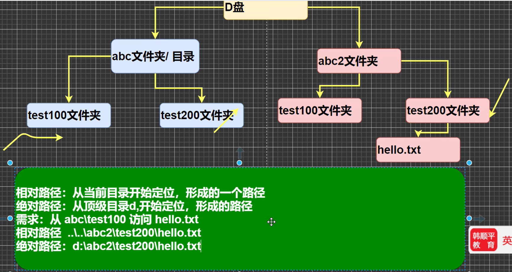

### 特点

* 跨平台性的（一个编译好的.class文件可以在多中系统上运行）
  JVM(java 虚拟机，java virtual machine)的存在使得同一个java程序在三个不同的操作系统中都可以执行，这样就实现了java程序的跨平台型。

### Java运行机制及运行过程

●Java核心机制-Java虚拟机[JVM java virtual machine]

1)JVM是一个虚拟的计算机，具有指令集并使用不同的存储区域。负责执行指令，管理数据、内存、寄存器，包含在JDK中.

2)对于不同的平台，有不同的虚拟机。

3)Jva虚拟机机制屏蔽了底层运行平台的差别，实现了“一次编译，到处运行”

### JDK与JRE

* JDK(Java Development Kit)，java开发工具。JDK = JRE + java的开发工具「java,javac,javadoc,jacap等」
* JDK是提供给Java开发人员使用的，其中包含了java的开发工具，也包括了JRE。所以安装了DK,就不用在单独安装JRE了。
* JRE(Java Runtime Enviroment java运行环境)

  JRE=VM+Java的核心类库[类]
* 包括Java虚拟机(JVM Java Virtual Machine)和Java程序所需的核心类库等，如果想要运行一个开发好的java程序，计算机中只需要安装JRE即可。



### 运行流程

.java-------(编译)-------.class------(运行)-------OK

### 注意事项与细节说明

1.Java源文件以.java为扩展名。源文件的基本组成部分是类(class),如本类中的Hello类。
2.Java应用程序的执行入口是main0方法。它有固定的书写格式：public static void main(String[]args){...I
3.Java语言严格区分大小写。
4.Java方法由一条条语句构成，每个语句以“：”结束。
5.大括号都是成对出现的，缺一不可。[习惯{}}先写}再写代码]
6.一个源文件中最多只能有一个public类。其它类的个数不限。
***7.如果源文件包含一个public类，则文件名必须按该类名命名！*
**8.一个源文件中最多只能有一个public类。其它类的个数不限，也可以将main方法写在非public类中，然后指定运行非public类，这样入口方法就是非public的main方法

### 转义字符



### 注释(文档注释等)

```
// code        单行注释
/* code */     多行注释

/**
 * @author 马卡卡
 * @version 1.0
**/  
文档注释，javadoc可以解析，author、version等为javadoc标签
```

 javadoc可将文档注释转换成html文件

```
javadoc -d 文件夹名称 -author -version hello.java
```

### 代码规范

1.类、方法的注释，要以javadoc的方式来写。
2.非Jlava Doc的注释(单行注释、多行注释)，往往是给代码的维护者看的，着重告述读者为什么这样写，如何修改，注意什么问题等
3.使用tab操作，实现缩进，默认整体向右边移动，时候用shift+tab整体向左移
4.运算符和 = 两边习惯性各加一个空格。比如：2 + 4 * 5 + 345 - 89
5.源文件使用utf-8编码
6.行宽度不要超过80字符
7.代码编写次行风格和行尾风格

### DOS指令(cmd windos)





### 绝对路径与相对路径


