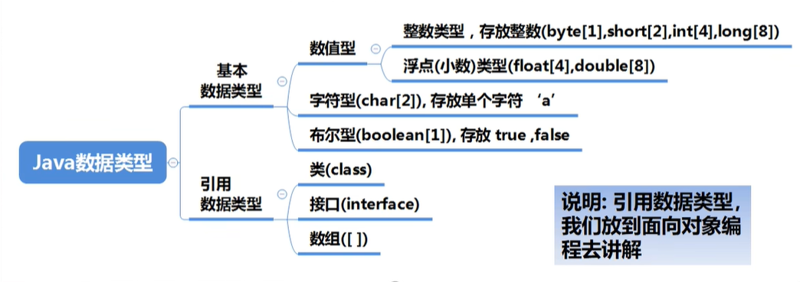
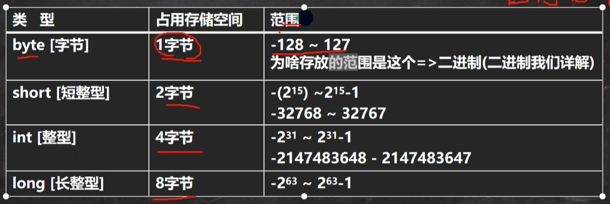
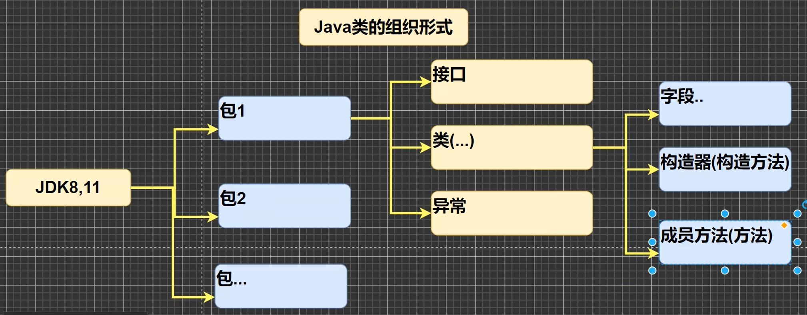
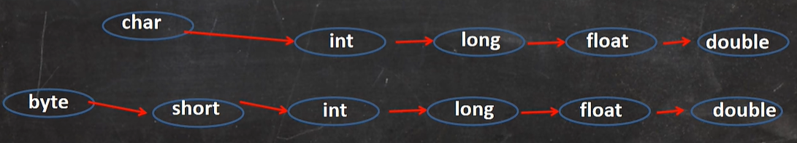

### 变量

类型：

* int
* double (浮点型)
* char
* String

1. 变量表示内存中的一个存储区域[不同的变量，类型不同，占用的空间大小不同，比如：int4个字节，double就是8个字节]
2. 该区域有自己的名称变量名]和类型[数据类型]
3. 变量必须先声明，后使用，即有顺序
4. 该区域的数据可以在同一类型范围内不断变化
5. 变量在同一个作用域内不能重名
6. 变量=变量名+值+数据类型，这一点请大家注意。
7. 变量三要素

### +号使用

1. 当左右两边都是数值型时，则做幼加法运算
2. 当左右两边有一方为字符串，则做拼接运算
3. 运算顺序，是从左到右

```java
System.out.println(100 + 3 + "hello")   // 103hello
System.out.println("hello" + 100 + 3)   // hello1003
```



### 整型



* 默认是int

### 浮点数

* 默认是double

不要用浮点数运算后的值与浮点数进行比较，例如 ``2.7 / 3``等于近似0.9的值。


### API（application programming interface,应用程序 编程接口）





[java8 api在线索引](https://www.matools.com/api/java8)


### 字符(char)

看代码datatype_02.java，挺有意思。

* 在java中，char的本质是一个整数，在输出时，是unicode码对应的字符。
* 可以直接给char赋一个整数，然后输出时，会按照对应的unicode字符输出
* char类型是可以进行运算的，相当于一个整数，因为它都对应有Unicode码
* ***字符常量是用单引号('')括起来的单个字符。注意与字符串的区别！***


### 字符类型(char)本质（ascll等）

* 字符型存储到计算机中需要将字符对应的码值（整数）找出来，转换成二进制存储即可。
* 字符与码值是通过字符编码表决定的，如ascll表
* 
* ASCLL表由一个字节表示，128个有效字符，实际一个字节有256个字符，但只用了128个。
* Unicode汉字与字母统一都是占用两个字节。(世界上所有的符号都纳入其中)，兼容ascll
* utf-8编码表是大小可变的(1-6个字节表示一个符号))，字母使用1个字节，汉字使用3个字节。在互联网上使用最广的Unicode使用方式
* bbk字母使用1个字节，汉字2个字节。


### 基本类型转换



* 有多种类型的数据混合运算时，系统首先自动将所有数据转换成容量最大的那种数据类型，然后再进行计算。
* (byte,short)和char之间不会相互自动转换.
* byte,short,char他们三者可以计算，在计算时首先转换为int类型
* boolean不参与转换

### 强制数据类型转换

目的：将高精度转换为低精度

```java
int n = (int)1.9
```

强转符号只针对于最近的操作数有效，往往会使用小括号提升优先级

char类型可以保存int的常量值，但不能保存int的变量值，需要强转 


### 基本数据类型与String的转换

基本类型--->String类型          将基本类型的值+""即可，如 ``int n1 = 100; String s1 = n1 + ""``

```java
int n1 = 100;
String s1 = n1 + "";
```

String----->基本类型              通过基本类型的包装类调用parseXX方法即可

```java
// 字符串转成基本数据类型
String s2 = "123";
int n2 = Integer.parseInt(s2);
double n3 = Double.parseDouble(s2);
float n4 = Float.parseFloat(s2);
long n5 = Long.parseLong(s2);
byte n6 = Byte.parseByte(s2);
boolean n7 = Boolean.parseBoolean("true");
short n8 = Short.parseShort(s2);
```


### 字符(char)与字符串的联系

字符定义： ``char s = 'm'`` 定义单个字符

字符串定义： ``String s = "ma"``


+对两者影响不同

char为单个字符，若加数字则通过unicode码值相加，得到int型。加char也是一样

String加数字则将其数字转为字符串再相加，得到字符拼接结果


转换(字符串索引)

```java
System.out.println(s.charAt(0))
```
