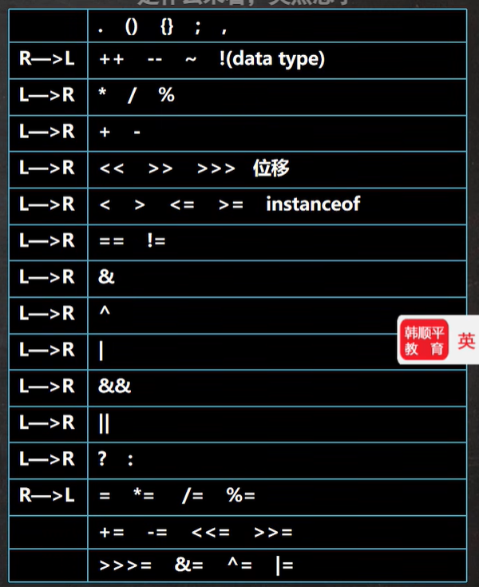

### 取余

```
a % b = a - (int)a / b * b   // 整数之间的运算，要舍弃小数点    若a为小鼠a取整舍弃小数位
```


### 自加减

```
int k = 1;
int j = ++k;    // 先自增后运算 k = k + 1, j = k

int k = 1;
int j = k++;    // 先运算后自增 j = k, k = k + 1
```


### 面试题（颠覆赋值概念）

```
int i = 1;
i = i++; // (1)temp = i;(2)i = i + 1;(3)i = temp
```


```
int i = 1;
i = ++i; // (1)i = i + 1;(2)temp = i;(3)i = temp
```


### 逻辑运算符

短路与&&   	两个条件有一个为假就是假

逻辑与&      	两个条件有一个为假就是假

***使用效果一样，但是&要判断两个条件，无论第一个是否正确都会判断第二个；而&&第一个为false就不再判断第二个，效率较高，经常使用！***

测试可以采用第二个条件中含有++运算符


短路或&&   	两个条件有一个为真就是真

逻辑或&      	两个条件有一个为真就是真


### 复合赋值运算符

复合赋值运算符会进行类型转换。


### 三元运算符

基本语法    ：    条件表达式？表达式1:表达式2;

1.如果条件表达式为true,运算后的结果是表达式1：

2.如果条件表达式为false,运算后的结果是表达式2；

```
int a = 10;
int b = 99;
int result = a > b ? a+ : b++;  // result = 10,a = 11,b = 99
```


### 运算优先级




### 命名规范

* 包名：多单词组成时所有字母都小写：aaa.bbb.ccc/比如com.hsp.crm
* 类名、接口名：多单词组成时，所有单词的首字母大写：XxxYyyZzz比如：TankShotGame 【大驼峰】
* 变量名、方法名：多单词组成时，第一个单词首字母小写，第二个单词开始每个单词首字母大写：xxxYyyZzZ比如：tankShotGame【小驼峰，简称驼峰法】
* 常量名：所有字母都大写。多单词时每个单词用下划线连接：XXX_YYY_ZZZ比如：定义一个所得税率TAX_RATE
* 


### 键盘输入语句(input)

采用三方包

```java
import java.util.Scanner;
class InputTest{
    public static void main(String[] args){
        // input anything
        Scanner myScanner = new Scanner(System.in);   // Scanner的对象
        System.out.println("输入名字:");
        String name = myScanner.next();
        System.out.println("输入年龄：");
        int age = myScanner.nextInt();
        System.out.println("名字 = " + name + "年龄 = " + age);
    }
}
```


### 原码、反码、补码

1. 二进制的最高位是符号位：0表示正数，1表示负数（老韩口诀：0->01->-）
2. 正数的原码，反码，补码都一样（三码合一）
3. 负数的反码=它的原码符号位不变，其它位取反(0->1,1->0)
4. 负数的补码=它的反码+1，负数的反码=负数的补码-1
5. 0的反码，补码都是0
6. java没有无符号数，换言之，java中的数都是有符号的
7. 在计算机运算的时候，都是以补码的方式来运算的(例如两个int按位与，则使用4个字节32位的补码进行运算)
8. 当我们看运算结果的时候，要看他的原码

适用于位运算符、逻辑运算符等
