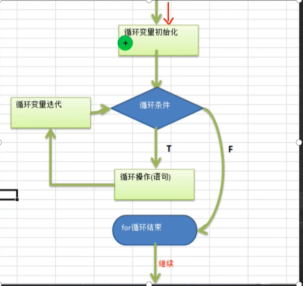
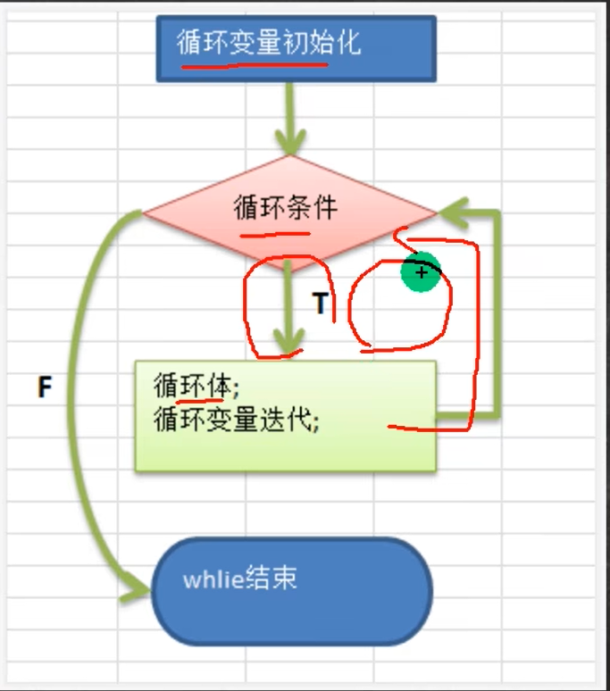
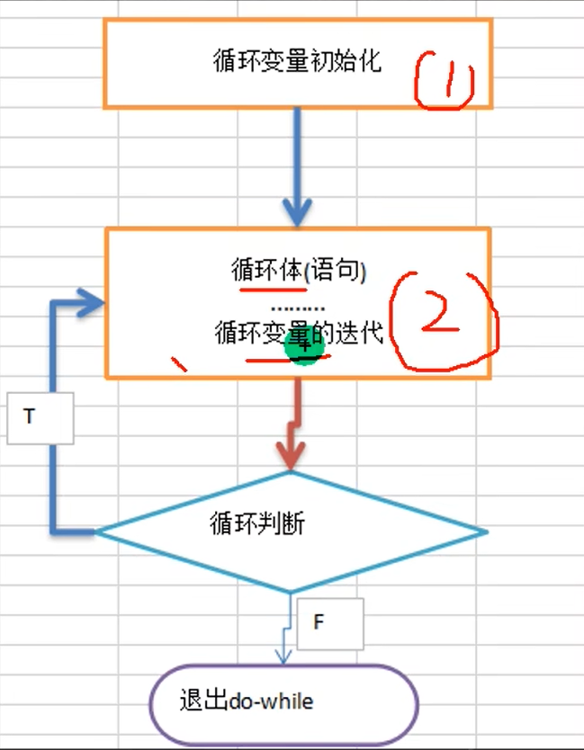

### 分支控制（if&switch)

```
if(){
}
else if(){
}

```

可以没有else

```java
switch(表达式或变量){
	case 常量1(表达式的返回值) : 
	语句块1;
	break;
	......
	default:
	默认语句块;
	break
}
```

switch细节注意：

* 表达式数据类型，应和case后的常量类型一致，或者是可以自动转成可以相互比较的类型，比如输入的是字符，而常量是 int
* switch(表达式)中表达式的返回值必须是：(byte,short,int,char,enum[枚举],String)，没有double
* case子句中的值必须是常量或表达式，而不能是变量（定义的也不行）
* default.子句是可选的，当没有匹配的case时，执行default
* break语句用来在执行完一个case分支后使程序跳出switch语句块；如果没有写 break,程序会顺序执行到switch结尾

### for循环

```java
for(循环变量初始化;循环条件;循环变量迭代){
	操作
}
```



### while循环

```java
while(循环条件){
	循环体(语句);
	循环变量迭代;
}
```



### do.while循环

```java
do{
	循环体(语句);
	循环变量迭代;
}while(循环条件);
```

先执行再判断，至少执行一次。



### break

可以退出for与while循环

退出最近的循环


### continue

continue用于结束本次循环，继续执行下一次循环。
