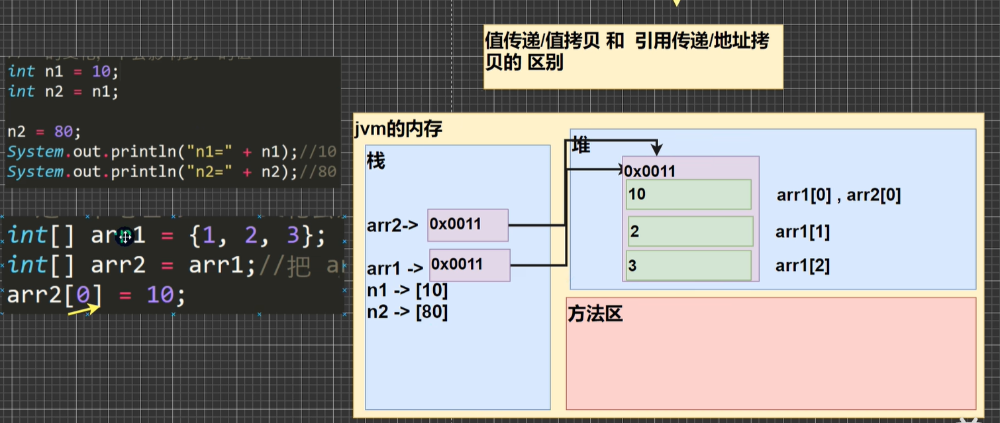
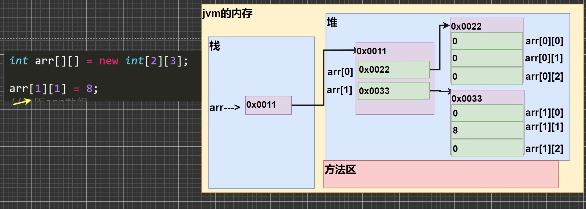

### 数组

```java
double hens[] = {1, 2, 3.0}
```

```java
hens.lengrh  // 长度
```

定义：

```java
int ls[] = new int[5]   // 动态初始化，法1

int ls[]  // 声明数组，只是一个空值变量，法2
ls = new int[5]  // 分配内存空间


```

### 注意事项

* 数组是多个相同类型数据的组合，实现对这些数据的统一管理（同一类型）
* 数组创建后，如果没有赋值，有默认值（int 0.short 0,byte 0,long 0,float 0.0,double 0.0,char \u0000，boolean false,String null）

### 数值赋值机制

基本数据类型赋值，这个值就是具体的数据，而且相互不影响。
int n1 = 2;int n2 = n1;

数组在默认情况下是引用传递，赋的值是地址

```
//基本数据类型赋值，赋值方式为值拷贝
//n2的变化，不会影响到n1的值
int n1=10;
int n2=n1;

n2=80;
System.out.println("n1=" + n1);//10
System.out.println("n2=" + n2);//80


//数组在默认情况下是引用传递，赋的值是地址，赋值方式为引用传达
//是一个地址，arr2变化会影响到arr1
int[] arr1 = {1,2,3};
int[] arr2 = arr1;//把arr1赋给arr2

```

对于数组，改变两个中的任意一个都会改变另一个。

存储：



### 数组拷贝（另一个数组数据空间独立）

```
int ls1[] = {1, 2, 3};
int ls[] = new int[3];
// 遍历依次赋值
```

### 数组反转

遍历并逆序赋值即可

### 数组添加扩容

再定义一个数组

### 冒泡排序

### 二维数组

定义：

```java
int ls[][] = {{1,2},{3,4}};

int ls[][] = new int[2][3]  // 两行三列

int ls[][] = new int[3][] //分配行的地址
ls[i][] = i+1;            //分配列空间


```

```java
// 遍历
for(int i=0;i<ls.length;i++){
    for(int j=0; j<ls[i].length; j++){
        System.out.print(ls[i][j] + "\t");
    }
    System.out.print("\n");
}
```

### 二维数组之间的内存

 
