### 类与对象(object)oop

类就是数据类型，比如Cat，int也是一种数据类型，只不过是官方定义的。

对象就是一个具体的实例，100是一个整型对象，是个具体的((值)。

### 内存中的形式

字符串是引用数据类型(数据类型包括基本数据类型和引用数据类型 [参考](http://c.biancheng.net/view/5672.html))，保存在方法区的常量池中；基本数据类型int直接存在堆中。

执行Cat cat 时加载Cat类信息，执行new时分配空间

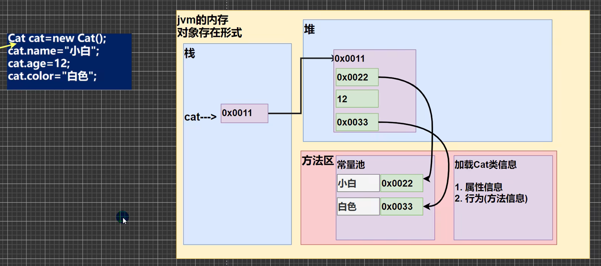

1.栈：一般存放基本数据类型（局部变量）

2.堆：存放对象(Catcat,数组等)

3.方法区：常量池（常量，比如字符串），类加载信息

4.示意图[Cat(name,age,price)

### 注意事项

1. 属性的定义语法同变量，示例：访问修饰符属性类型属性名：
   这里老师简单的介绍访问修饰符：控制属性的访问范围
   有四种访问修饰符public,proctected,默认，private,后面我会详细介绍
2. 属性的定义类型可以为任意类型，包含基本类型或引用类型
3. 属性如果不赋值，有默认值，规则和数组一致。具体说：
   int 0,short 0,byte 0,long 0,float 0.0,double 0.0,char \u0000,boolean false,String null

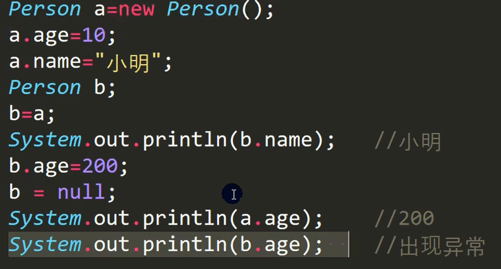

b=null 导致b变为null，即地址为空，不指向任何地方。

### 创建

```
Cat cat1; //声明对象cat1,cat1是空值
cat1 = new Cat(); // 创建,开辟一个空间，空间地址赋值给cat1

Cat cat1 = new Cat();
```

### 方法调用机制原理

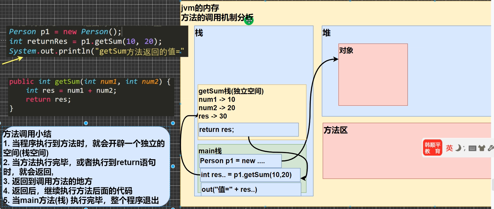

### 方法的细节

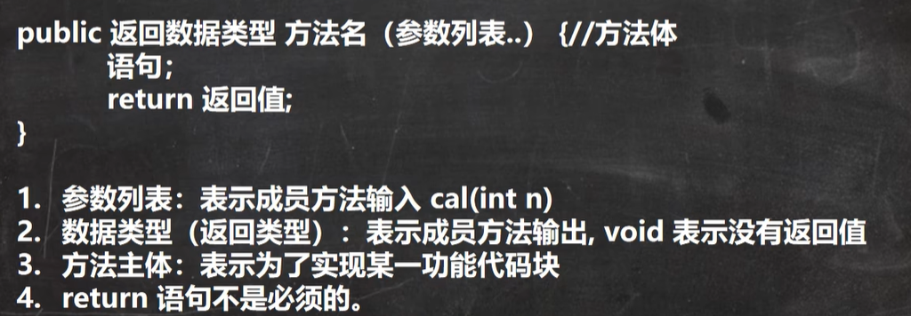

public 是访问修饰符

1. 一个方法最多有一个返回值（多个就合在一起返回数组等，此时返回数据类型为int[]）
2. 返回类型可以为任意类型，包含基本类型或引用类型（数组，对象）
3. 如果方法要求有返回数据类型，则方法体中最后的执行语句必须为return值；而且要求返回值类型必须和return的值类型一致或兼容
4. 如果方法是void,则方法体中可以没有return语句，或者只写return;
5. 方法名
   遵循驼峰命名法，最好见名知议，表达出该功能的意思即可，比如得到两个数的和getSum,开发中按照规范

***参数细节***

1. 一个方法可以有0个参数，也可以有多个参数，中间用逗号隔开，比如getSum(intn1,ntn2)
2. 参数类型可以为任意类型，包含基本类型或引用类型，比如printArr(int map[][])
3. 调用带参数的方法时，一定对应着参数列表传入相同类型或兼容类型的参数！【getSum】
4. 方法定义时的参数称为形左式参数，简称形参；方法调用时的参数称为实际参数，简称实参，实参和形参的类型要一致或兼容、个数、顺序必须一致！
5. 方法定义不可嵌套

***调用细节***

1. 同一个类中的方法调用：直接调用即可，即方法定义时相互调用
2. 跨类中的方法A类调用B类方法：需要通过对象名调用。需要定义一个新的类并类名.方法(参数)进行调用
3. 基本数据类型，传递的是值（值拷贝），形参的任何改变不影响实参！(方法无法改变外部基本数据类型变量)
4. 引用类型传递的是地址（传递也是值，但是值是地址），可以通过形参影响实参！引用类型包括数组、对象（变量名都是地址）
5. 

*** 重要(213集)

```
Person p = new Person();
p.age = 10;
b.test(p); //假设已定义
p.age();   //还是10

class B(){
	public void test(Person p){
		p = null;
	}
}
```

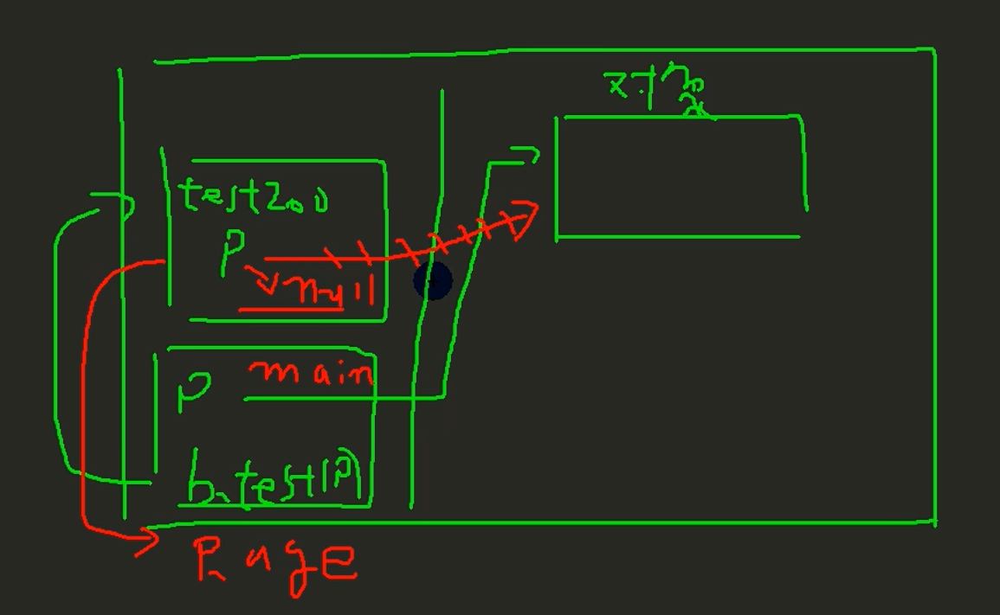

```
Person p = new Person();
p.age = 10;
b.test(p); //假设已定义
p.age();   //还是10

class B(){
	public void test(Person p){
		p = new Person();
		p.age = 99;
	}
}
```

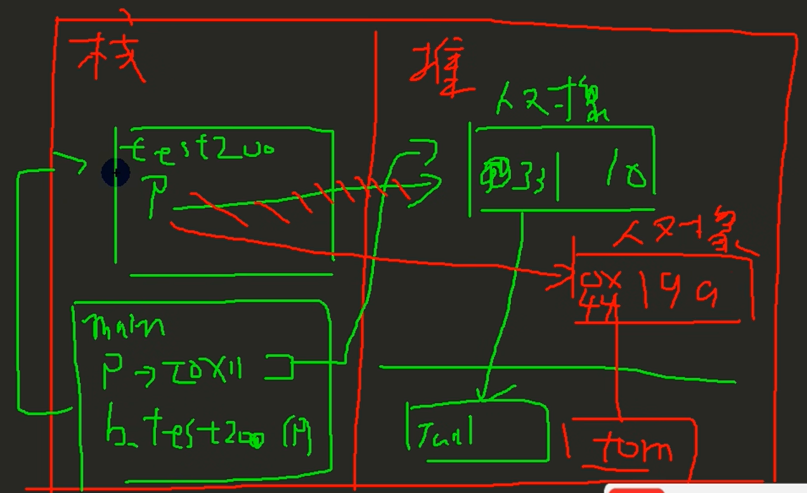

### 对象的拷贝

```
class MyTools{
	public Person objectCopy(Person p){
		Person p1 = new Person();
		p1.name = p.name;
		p1.age = p.age;
		return p1;
	}
}
Mytools mytools = new Mytools();
Person p = new Person();
Person p1 = mytools.objectCopy(p);
```

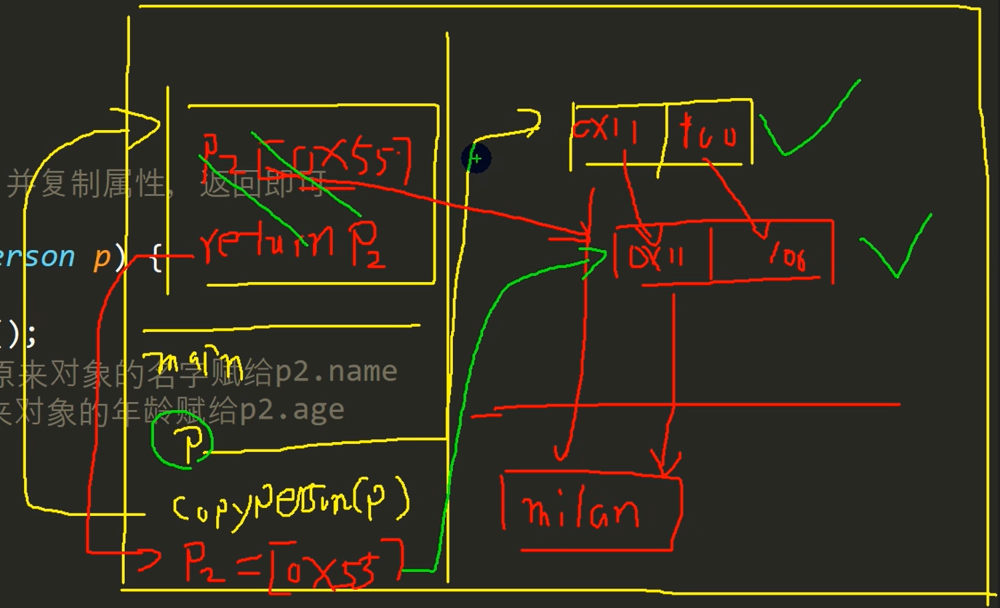

### 递归

  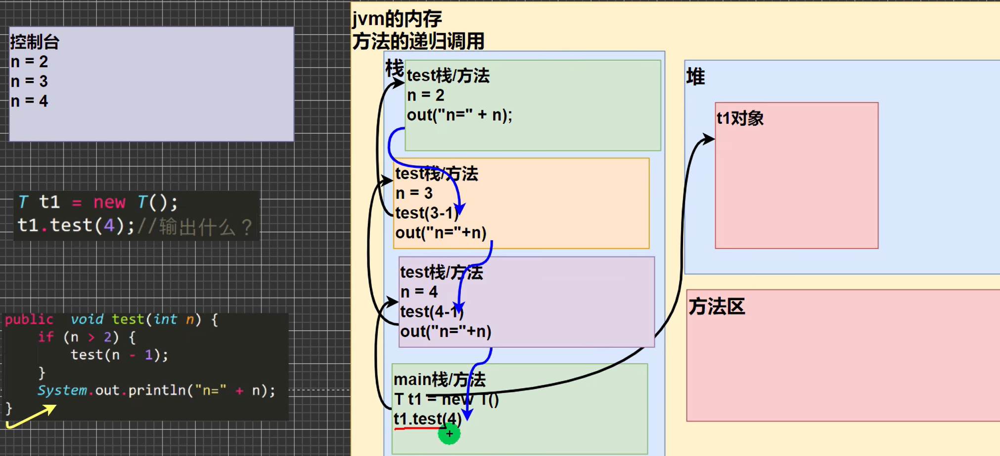

***每个递归都会完整的执行一整个test栈（方法）***

1. 执行一个方法时，就创建一个新的受保护的独立空间（栈空间）
2. 方法的局部变量是独立的，不会相互影响，比如变量n
3. 如果方法中使用的是引用类型变量（比如数组，对象），就会共享该引用类型的数据
4. 递归必须向退出递归的条件逼近，否则就是无限递劃归出现 StackOverflowError,死龟了：)
5. 当一个方法执行完毕，或者遇到return,就会返回，遵守谁调用，就将结果返回给谁，同时当方法执行完毕或者返回时，该方法也就执行完毕。

### 栈内存

new时在堆中创建新空间，t=new时将t指向堆中的空间(先在堆中开辟空间)；

执行方法时创建新栈

### 方法重载()overload)

java中允许同一个类中，多个同名方法的存在，但要求形参列表不一致！ t比如：System.out.printIn();out是PrintStream类型

```
//两个整数的和
public int calculate(int n1,int n2){
	return n1+n2;
}
//一个整数，一个double的和
public double calculate(int n1,double n2){
	return n1+n2;
}
```

** *注意事项***

1)方法名：必须相同
2)形参列表：必须不同(形参类型或个数或顺序，至少有一样不同，参数名无要求)
3)返回类型：无要求

无要求的意思是无影响，即参数名a、b都一样，无所谓

### 可变参数

概念：java允许将同一个类中多个同名同功能但参数个数不同的方法，封装成一个方法。

 定义：nums可以当作数组使用

```java
public int sum(int... nums){
	//遍历数组加和
}
```

细节：

* 1)可变参数的实参可以为0个或任意多个
* 2)可变参数的实参可以为数组（直接sum(数组) ）
* 3)可变参数的本质就是数组
* 4)可变参数可以和普通类型的参数一起放在形参列表，但必须保证可变参数在最后（定义时 ）
* 5)一个形参列表中只能出现一个可变参数

```java
int arr[] = new int[3];
class T{
    //细节：可变参数的实参可以为数组；可变参数的本质就是数组
	public void f1(int... nums){
        System.out.println("长度= " + nums.length);
    }

    //可变参数可以和普通类型的参数一起放在形参列表，但必须保证可变参数在最后（定义时 ）
    public void f2(String str, int... nums){
        return;
    }

    //一个形参列表中只能出现一个可变参数(下面是错误的)
    public void f3(int... nums1, double... nums2){
	return;
    }
}
```

### 作用域

* 全局变量可以不赋值，直接使用，因为有默认值，局部变量必须赋值后，才能使用，因为没有默认值。
* 属性（类里的全局变量）和局部变量可以重名，访问时遵循就近原则
* 全局变量/属性：可以被本类使用，或其他类使用(通过对象调用)
  局部变量：只能在本类中对应的方法中使用
* 全局变量/属性可以加修饰符（public,private)
  局部变量不可以加修饰符

调用新方法（类似继承）

```java
Person p1 = new Person();
p1.name = "makaka";
T.test(p1);

public void test(Person p){
	System.out.println(p.name);
}

```


### 构造方法/构造器

[修饰符] 方法名(形参列表){

    方法体;}


构造方法又叫构造器(constructor),是类的一种特殊的方法，它的主要作用是完成对**新对象的初始化**。它有几个特点：
1)方法名和类名相同
2)没有返回值
3)在创建对象时，系统会自动的调用该类的构造器完成对对象的初始化。


***细节***

* 一个类中可以定义多个构造器，即构造器重载
* 构造器名和类名要相同
* 构造器没有返回值
* 构造器是完成对象的初始化，并不是创建对象
* 在创建对象时，系统自动的调用该类的构造方法
* 如果程序员没有定义构造器，系统会自动给类生成一个默认无参构造器（也叫默认构造器）
* 一旦定义了自己的构造器，默认的构造器就覆盖了，就不能再使用默认的无参构造器，除非显式的定义一下，即：Person(){}写

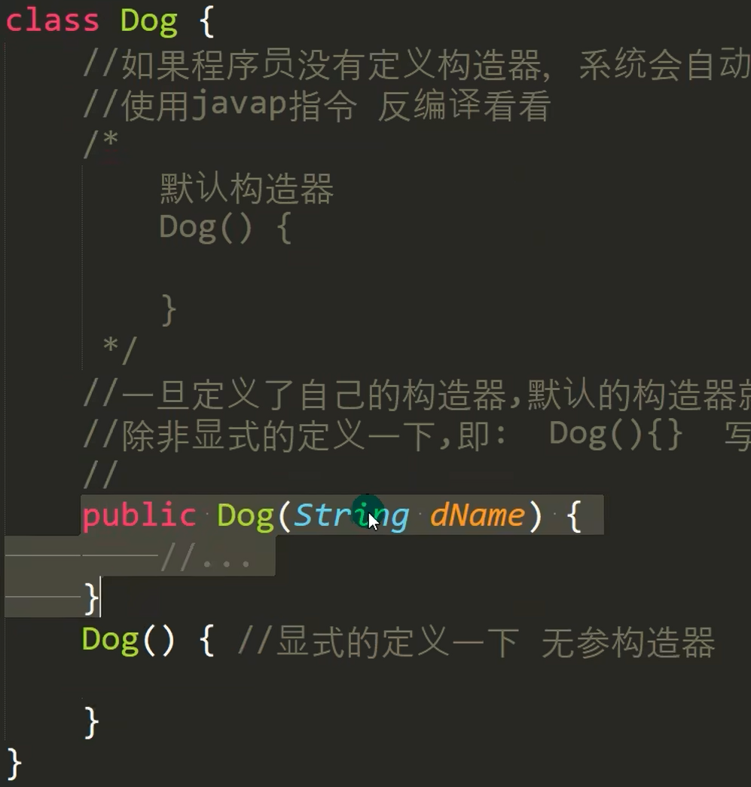

***重要***

如果程序员没有定义构造器，系统会自动给类生成一个默认无参构造器（也叫默认构造器）

```
Person p1 = new Person(); //没有构造器，系统有默认构造器

Person p2 = new Person("maka"); //自己写了一个构造器
```

这是对应的！


### 对象创建的流程（重要，内存中）

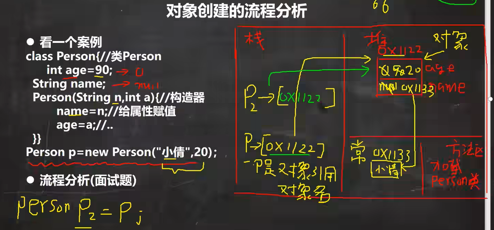

1：加载Person类信息(Person.class)，只会加载一次

2：在堆中分配空间（地址）

3：完成对象初始化【1：默认初始化age=0 name=null 2：显式初始化age=90,name=null3：构造器的初始化age=20 name=小倩】

4：对象在堆中的地址，返回给p（p是对象名，也可以理解成是对象的引用）


### this关键字

java虚拟机会给每个对象分配this,代表当前对象。坦白的讲，要明白this不是件容易的事，我给大家打一个比方。[上帝创世界小故事]

this小结：简单的说，哪个对象调用， this就代表哪个对象

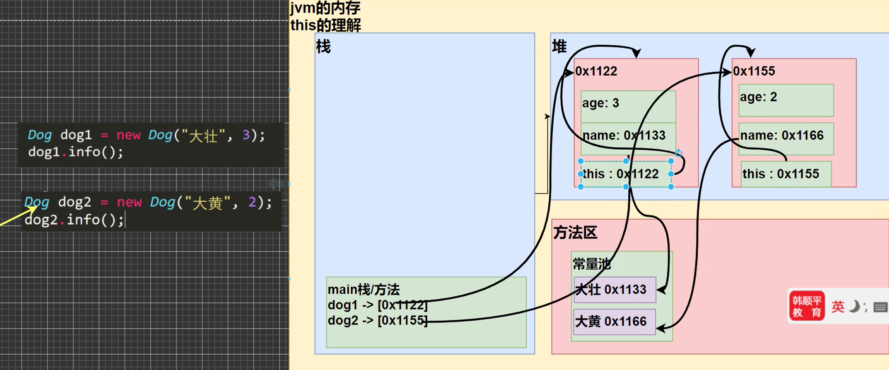

创建对象时，会有隐藏的this,其为对象地址指向本身。

可以用hashCode()验证


### this细节

1. 原知识点：同一个类中方法可以直接相互调用；现知识点：也可以用this.方法名(参数列表) 进行同类之间的方法调用
2. ths关键字可以用来访问本类的属性、方法、构造器
3. ths用于区分当前类的属性和局部变量
4. 访问构造器语法：this(参数列表)：**注意只能在构造器中使用(即只能在构造器中访问另外一个构造器且必须放在第一句)**
5. this不能在类定义的外部使用，只能在类定义的方法中使用


Q4:

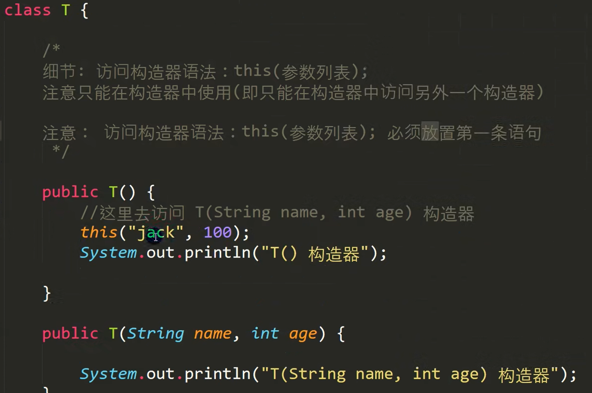


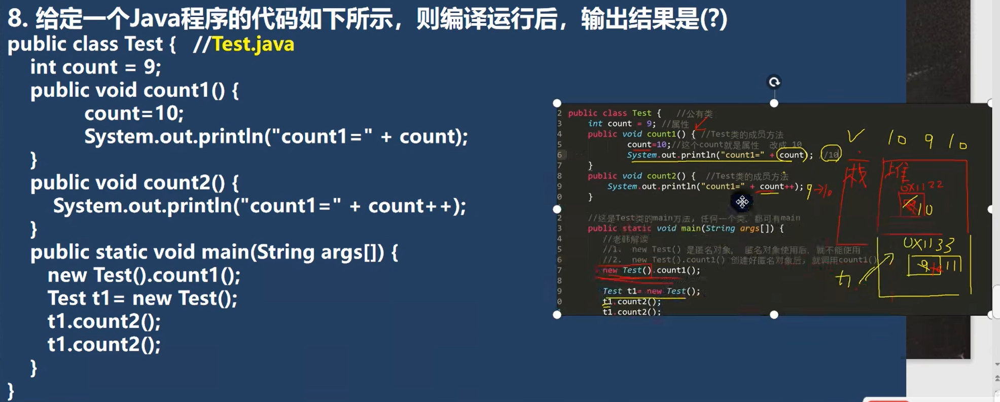
