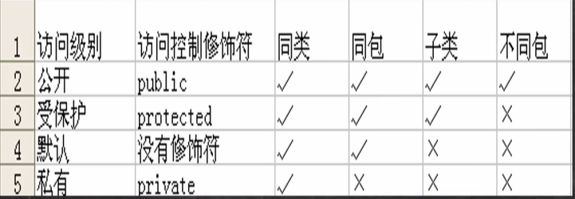
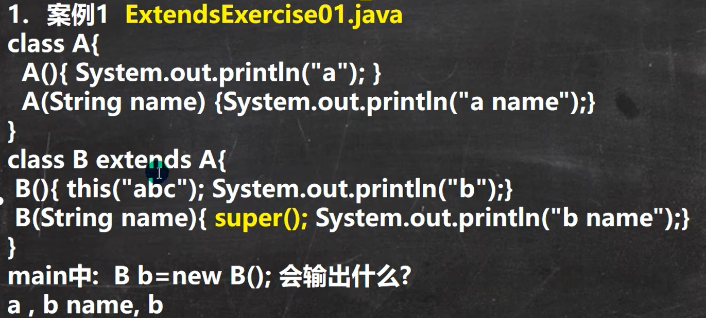

### 包

***包的三大作用***
1.区分相同名字的类
2.当类很多时，可以很好的管理类
3.控制访问范围

***基本语法***

```
package cpm.pac
```

1:package关键组表示打包

2:com.pac表示包名

***包的本质***

包的本质实际上就是创建不同的文件夹来保存类文件


***命名规则***

只能包含数字、字母、下划线、小圆点，但不能用数字开头，不能是关键字或保留字

***命名规范***

一般是小写字母+小圆点一般是
com.公司名.项目名.业务模块名
比如：com.hspedu.oa.model;com.hspedu.oa.controller;

***常用的包***

一个包下，包含很多的类，java中常用的包有：

```
java.lang.*  //lang包是基本包，默认引入，不需要再引入.
java.util.*  //util包，系统提供的工具包，工具类，使用 Scanner
java.net.*  //网络包，网络开发
java.awt.*  //是做java的界面开发，GUI
```

***导入方法***

```
//推荐第一种方法
imoport java.util.Scanner; //表示只会导入Scanner类

import java.util.*  //全部导入
```

```
package code.chapter_07.com.use;

import code.chapter_07.com.tom.Dog;
import code.chapter_07.com.jack.Dog; //必须有
public class test {
    public static void main(String[] args){
        Dog dog = new Dog();//默认Dog是第一个(tom)
        code.chapter_07.com.jack.Dog dog1 = new code.chapter_07.com.jack.Dog();
        System.out.println(dog);//code.chapter_07.com.tom.Dog@15db9742
        System.out.println(dog1);//code.chapter_07.com.jack.Dog@6d06d69c
    }
}
```

***注意细节***

* package的作用是声明当前类所在的包，需要放在类的最上面，一个类中最多只有一句package
* import放在package下面，可以有多句无序

### 访问修饰符(modifier)

java提供四种访问控制修饰符号，用于控制方法和属性（成员变量）的访问权限(范围)

1. 公开级别：用public修饰，对外公开
2. 受保护级别：用protected修饰，对子类和同一个包中的类公开
3. 默认级别没有修饰符号，向同一个包的类公开
4. 私有级别：用private修饰，只有类本身可以访问，不对外公开



***注意事项***

* 修饰符可以用来修饰类中的属性，成员方法以及类
* 只有默认的和public才能修饰类，并且遵循上述访问权限的特点。
* 成员方法的访问规则和属性完全一样

### 面向对象编程三大特征

#### 封装

封装(encapsulation)就是把抽象出的数据[属性]和对数据的操作[方法]封装在一起，数据被保护在内部，程序的其它部分只有通过被授权的操作[方法]，才能对数据进行操作。

***好处***

1. 隐藏实现细节：方法（连接数据库）<--调用（传入参数...）
2. 可以对数据进行验证，保证安全合理。

封装实现步骤

1. 将属性进行私有化(private) 【不能直接修改属性】
2. 提供一个公共的(public)set方法，用于对属性判断并赋值

```
public void setXxx(类型 参数名){//Xxx 表示属性
    //加入数据验证的业务逻辑（别让赋值太离谱）
    属性 = 参数名；
    }
```

   3.提供一个公共的(public)get方法，用于获取属性的值

```
public数据类型getXxx(){//权限判断，Xxxx某个属性
    return xx;
    }
```

***将构造器与serXxx结合(定义时也需要判断而非随意定义)***

```
public Person(String name, int age, double salary, String job) {
    setAge(age);//==this.setAge(age)
    setJob(job);
    setName(name);
    setSalary(salary);
}
```

#### 继承

继承可以解决代码复用，让我们的编程更加靠近人类思维.当多个类存在相同的属性（变量）和方法时，可以从这些类中抽象出父类，在父类中定义这些相同的属性和方法，所有的子类不需要重新定义这些属性和方法，只需要通过extends来声明继承父类即可。


```
//语法：
class 子类 extends 父类{
}
```

 ***细节***

1：子类继承了所有的属性和方法，但是私有属性和方法不能在子类直接访问，要通过父类提供公共的方法去访问

2：子类必须调用父类的构造器，完成父类的初始化

    父类无参构造器会被子类的无参构造器默认调用(super)

3：当创建子类对象时，不管使用子类的哪个构造器，默认情况下总会去调用父类的无参构造器，如果父类没有提供无参构造器，则必须在子类的构造器中用super去指定使用父类的哪个构造器完成对父类的初始化工作，否则，编译不会通过

```
//父类构造器
public Student(String name, int score){
    this.name = name;
    this.score = score;
}
//子类构造器
public class Pupil extends Student{
    String studentId;
    // 显式构造函数，调用父类的有参构造函数
    public Pupil(String name, int age,  String studentId) {
        super(name, age); // 调用父类构造函数
        this.studentId = studentId; // 子类自己的初始化
    }
}
```

4：如果希望指定去调用父类的某个构造器，则显式的调用一下

5：super在使用时，需要放在构造器第一行

6：super和this都只能放在构造器第一行，因此这两个方法不能共存在一个构造器(this存在则默认d的super被覆盖)

7：java所有类都是Object类的子类

8：父类构造器的调用不限于直接父类！将一直往上追溯直到Object类（顶级父类）最先实现顶层父类的修饰器

9：子类最多只能继承一个父类（指直接继承），即java中是单继承机制。

10：不能滥用继承，子类和父类之间必须满足is-a的逻辑关系

***继承的内存布局***

1：自上而下加载类

2：在堆里创建的对象空间中开辟多个小空间（个数为父类及自身的个数和），从上到下依次初始化

3：访问对象属性时，自下而上查找该属性，有且可以访问则返回，否则继续向上查找。若有但无法(private)访问则报错，无法再向上找父类的属性!


***课后习题***

1：

B()先执行，由于有this所以没有super了，直接执行this("abc")，即本类的另一个构造器B(String name)，默认有super()，执行父类的无参构造器A()，先输出a，再输出b name，再输出b

##### super

***细节***

1:访问父类的属性，但不能访问父类的orivate属性[案例]super.属性名

2:访问父类的方法，不能访问父类的private方法super.方法名（参数列表）

3:访问父类的构造器（这点前面用过）：super(参数列表)；只能放在构造器的第一句，只能出现一句！

4:当子类中有和父类中的成员（属性和方法）重名时，为了访问父类的成员，必须通过super。如果没有重名，使用super、.this、直接访问是一样的效果！

访问属性或方法时，都是自下而上查找。

super.属性/方法：从父类开始查找调用，找到了但无权限则报错；

直接使用或this.属性/方法使用从自己开始查找调用，再向上查找，找到了但无权限则报错；


##### super与this的比较


##### 方法重写(override)

简单的说：方法覆盖（重写）就是子类有一个方法，和父类(更上一级也行)的某个方法的名称、返回类型、参数一样，那么我们就说子类的这个方法覆盖了父类的那个方法

* 子类的方法的参数，方法名称，要和父类方法的参数，方法名称完全一样。
* 子类方法的返回类型和父类方法返回类型一样，或者是父类返回类型的子类。比如父类返回类型是Object,子类方法返回类型是String(在Java中，所有的类都继承自 `java.lang.Object`类。这也意味着 `String`类也是 `Object`类的子类。)
* 子类方法不能缩小父类方法的访问权限(子类不能定义private而父类定义public的)public > protected > 默认 > private，但可以放大范围

##### 重载与重写区别与联系


重写中，若要调用父类的方法需要使用super，不能直接调用或this.方法 调用，因为会调用本身的同名方法。

#### 多态(polymorphic)

方法或对象具有多种形态。是面向对象的第三大特征，多态是建立在封装和继承基础之上的。

##### 多态的具体表现

1. 一个对象的编译类型和运行类型可以不一致
2. 编译类型在定义对象时，就确定了，不能改变
3. 运行类型是可以变化的
4. 编译类型看定义时=号的左边，运行类型看=号的右边

调用对象方法时，方法为当前对象的运行类型的方法(Cat与Dog都是Animal的子类)


***细节***

前提：两个对象(类)存在继承关系

***多态的向上转型：***

    本质：父类的引用指向了子类的对象

    语法：父类类型引用名 = new 子类类型();

    特点：编译类型看左边，运行类型看右边

    可以调用父类中的所有成员(须遵守访问权限)

    不能调用子类中的特有成员(方法属性等)//因为在编译阶段，能调用哪些成员是由编译类型决定的，虽然本质上是运行类型

    最终运行效果看子类的具体实现//遵守从本类向父类(向上)开始查找

多态的向下转型

语法：子类类型  引用名 = (子类类型) 父类引用;

只能强转父类的引用，不能强转父类的对象

要求父类的引用必须指向的是当前目标类型的对象(Poly_->User文件)

当向下转型后。可以调用子类类型的特有方法与属性

属性没有重写之说！属性的值看编译类型

instanceOf比较操作符，用于判断对象的类型(运行类型，即实际类型)是否为XX类型或XX类型的子类型

作业题：


##### java的动态捆绑机制

当调用对象方法的时候(例如向上转型调用父类的方法中再调用方法，会先调用子类的)，该方法会和该对象的内存地址(也就是运行类型)绑定

当调用对象属性时，没有动态绑定机制，哪里声明，哪里使用

##### 多态应用

***多态数组：(PolyArray_)***

数组的定义类型为父类类型，里面保存的实际元素类型为子类类型

***多态参数：(PolyParameter很重要，特别是注释)***

方法定义的形参类型为父类类型，实参类型允许为子类类型

### Object类详解（根类）

##### ***==与equals的对比***

==：

既可以判断基本类型，又可以判断引用类型

如果判断基本类型，判断的是值是否相等。示例：inti=10;double d=10.0:

如果判断引用类型，判断的是地址是否相等，即判定是不是同一个对像

equals:

是Object:类中的方法，只能判断引用类型

默认判断的是地址是否相等(Object)，子类中往往重写该方法，用于判断内容是否相等。比如 Integer,String()


##### hashCode()

返回该对象的哈希值

* 提高具有哈希结构的容器的效率！
* 两个引用，如果指向的是同一个对象，！则哈希值肯定是一样的！
* 两个引用，如果指向的是不同对象，则哈希值是不一样的
* 哈希值主要根据地址号来的，不能完全将哈希值等价于地址。

##### toString

返回该对象的字符串形式

//全类名(包名+类名)：getClass().getName()

默认返回：全类名+@+哈希值的十六进制

一般重写后把对象的属性值输出

当直接输出一个对象时，toString方法会被默认的调用，比如:

```java
Object p = new Object(); //定义对象
p //toString显示重写的对象信息

@Override
public String toString() {
    return "Person [name=" + name + ", age=" + age + ", job=" + job + "]";
}
```

##### finalize(面试多实际使用少)

* 当对象被回收时(并不是变成垃圾的一瞬间就被回收)，系统自动调用该对象的finalize方法。子类可以重写该方法做一些释放资源的操作
* 什么时候被回收：当某个对象没有任何引用时，则jvm就认为这个对象是一个垃圾对象，就会使用垃圾回收机制来销毁该对象，在销毁该对象前，会先调用 finalize方法(可以写自己的逻辑代码如数据库链接等)。
* 若没有重写则调用Object的方法
* 垃圾回收机制的调用，是由系统来决定（即有自己的GC算法），也可以通过 System.gc()主动触发垃圾回收机制。(非阻塞代码，且并不一定实时调用成功)


### 作业


编译类型不可改变


